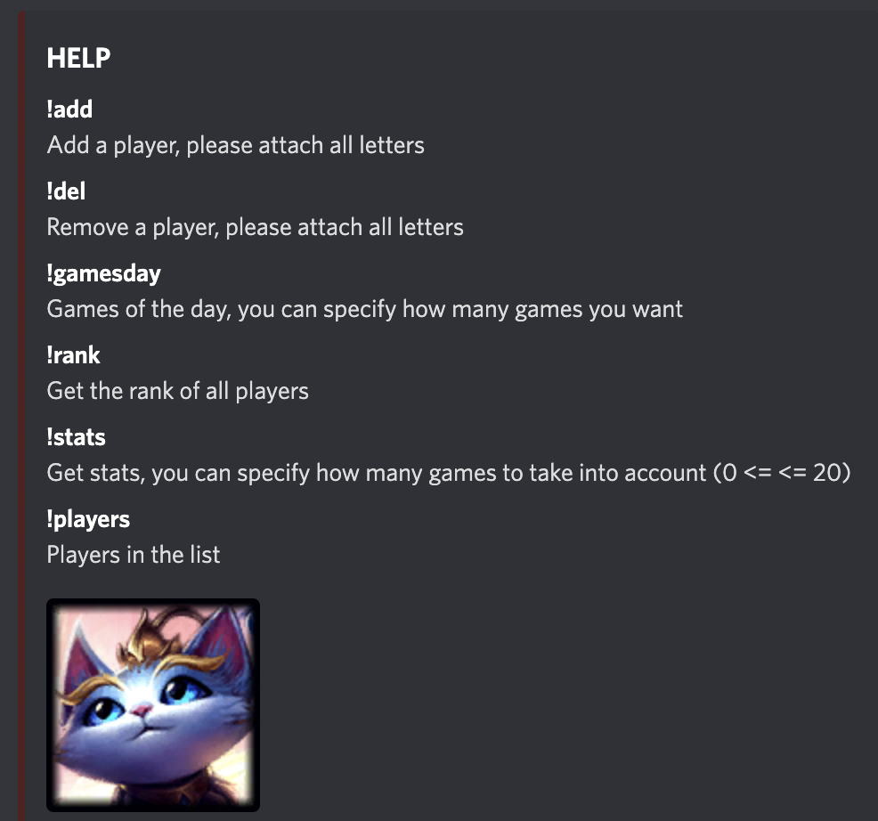

# League of Legends Bot

We construct this discord bot to share some stats of your custom list of players. The available commands are :



## Run the Bot

You need two things to give life to your bot.

### Create a Discord developer account

Follow this [link]() to follow a tutorial to create your bot, get a key and to add the bot to your favorite server.
[The Discord Developer Portal](https://discord.com/developers/docs)

### Get your Riot api key

Go on the Riot API portal, create an account and register your product. You can easily register a product for a little
community and get a `personal api key`. Please note that you will have request limits.

### Add the following files in the `discord` directory

Add a file `.env` in `discord` and complete the different information with this format.

```
BOT_KEY = "XXXXX"
API_KEY = "XXXXX"
region_code = "XXXXX"
region = "XXXXX"
```

In our case, the region_code is `euw1` and the region is `europe`.

You can also add a json file with players pseudo (or you can add after with the command add). Use the format above.

```json
{
  "list_id": [
    "id1",
    "id2",
    "etc"
  ]
}
```

### Finally, run your bot

You can run the bot in a [docker](https://www.docker.com/) container. To do that use the following command :

1. `docker build -t riotbot .` to construct the image.
2. `docker run riotbot` to run your application.
3. `docker stop CONTAINER_ID` to stop your application.

Otherwise, you can run the file `bot.py` (do not forget to install the `requirements.txt`).

## To go further and issues

This bot is not perfect at all, follow the [Riot API](https://developer.riotgames.com/) and
the [discord.py](https://discordpy.readthedocs.io/) documentation to add some features. Feel free to modify the bot to
have better manage of `Exception` for example.

You can for example modify the display with some [embedding](https://discordpy.readthedocs.io/en/stable/api.html?highlight=embed#discord.Embed) to have a more friendly phone
display.

As we use a Riot Api Key `personnal`, sometime we have problems due to the request limits. Just wait and retry the
command.

You will probably discover bugs, this bot was indeed develop fast and just for a fun use 😊.
